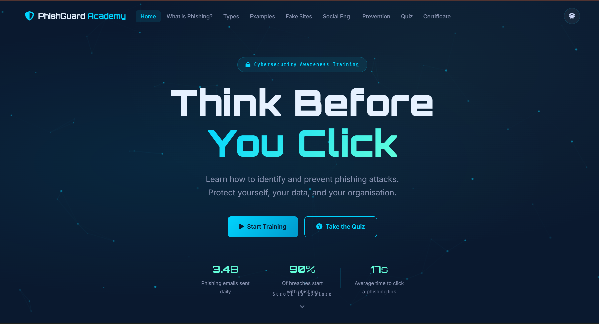
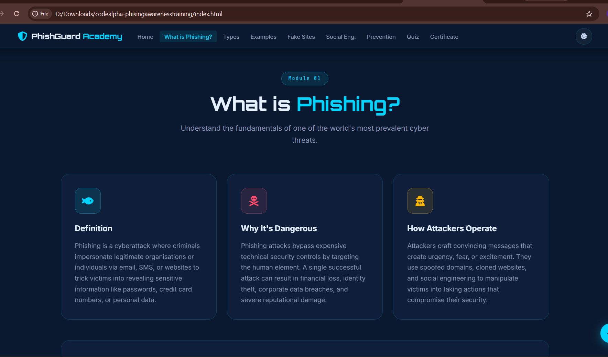
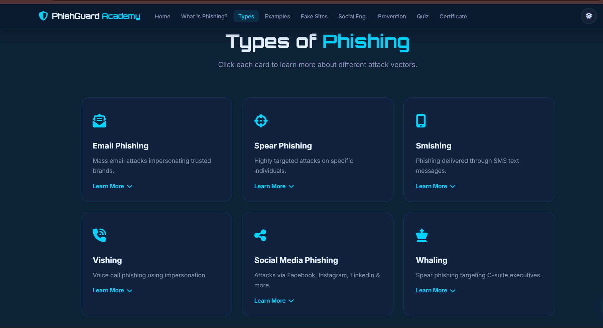
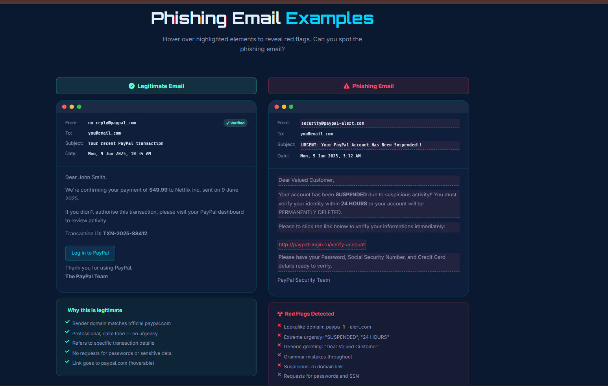
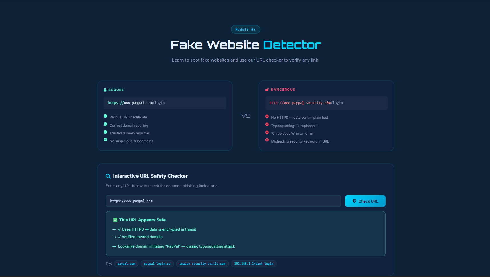
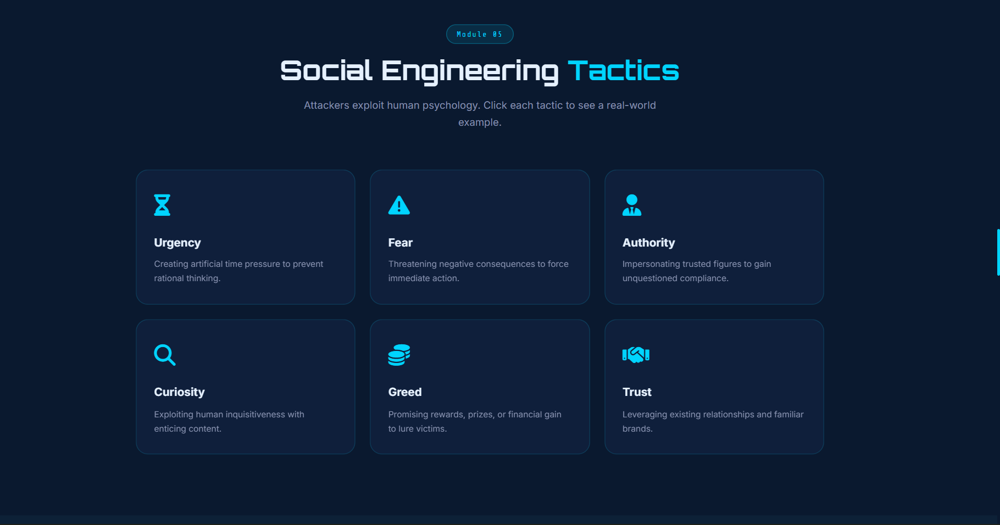
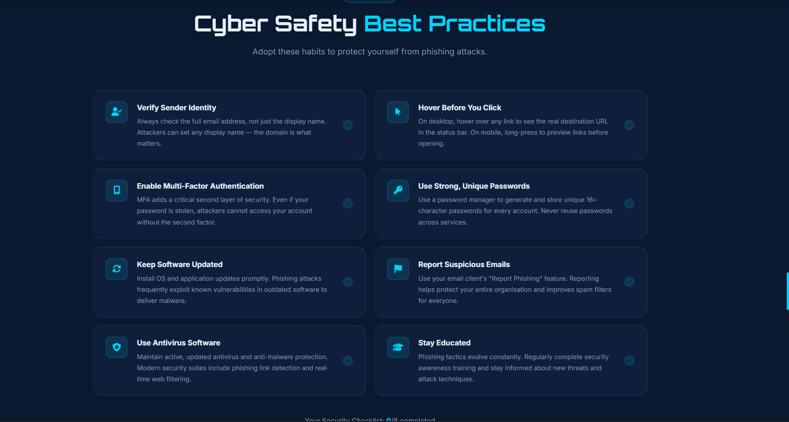
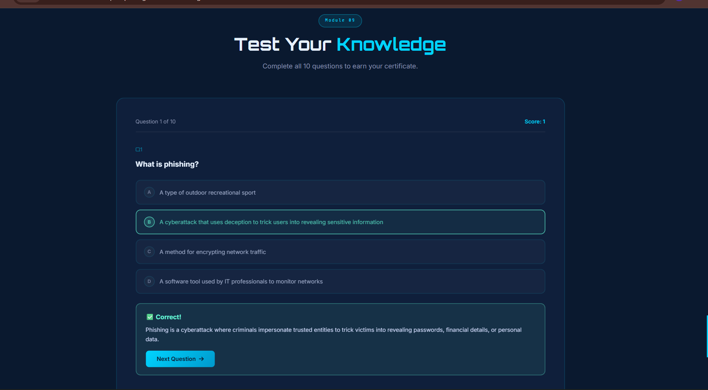
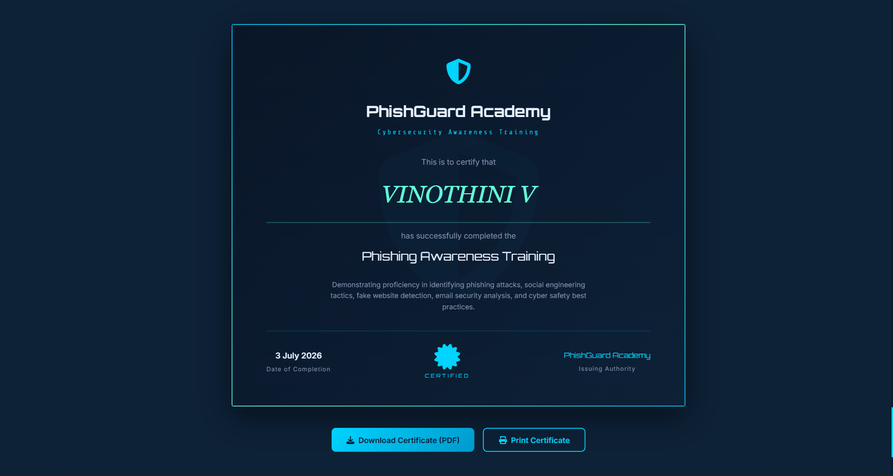

# 🛡️ PhishGuard Academy – Phishing Awareness Training

An interactive cybersecurity awareness platform designed to educate users about phishing attacks, social engineering techniques, and online safety. This project provides real-world phishing examples, prevention tips, an interactive quiz, and a downloadable certificate to enhance cybersecurity awareness.

> Developed as part of the **CodeAlpha Cyber Security Internship**.

---

## 📌 Project Overview

Phishing is one of the most common cyber threats used to steal sensitive information such as usernames, passwords, banking credentials, and personal data. **PhishGuard Academy** helps users understand phishing attacks through interactive learning modules, realistic examples, quizzes, and practical security tips.

---

## ✨ Features

- 🛡️ Interactive cybersecurity awareness platform
- 📖 Learn what phishing is and how it works
- 🎣 Different types of phishing attacks
- 📧 Phishing email examples and detection tips
- 🌐 Fake website identification
- 🕵️ Social engineering awareness
- 💡 Cybersecurity best practices and prevention tips
- 📝 Interactive phishing awareness quiz
- 🏆 Certificate generation after quiz completion
- 🌙 Dark/Light mode support
- 📱 Responsive design for desktop and mobile
- ✨ Smooth animations and modern UI

---

## 🛠️ Technologies Used

- HTML5
- CSS3
- JavaScript
- Font Awesome
- Google Fonts
- html2canvas
- jsPDF

---

## 📂 Project Structure

```text
codealpha-phisingawarenesstraining/
│
├── index.html
├── style.css
├── script.js
├── README.md
├── Screenshot/
│   ├── HomePage.png
│   ├── WhatIsPhishing.png
│   ├── TypesOfPhishing.png
│   ├── EmailExamples.png
│   ├── FakeWebsite.png
│   ├── SocialEngineering.png
│   ├── Prevention.png
│   ├── Quiz.png
│   └── Certificate.png
```

---

## 🚀 Getting Started

### Clone the Repository

```bash
git clone https://github.com/VINOTHINI-006/codealpha-phisingawarenesstraining.git
```

### Open the Project

Navigate to the project folder and open:

```text
index.html
```

in your preferred web browser.

No installation or additional dependencies are required.

---

# 📸 Project Screenshots

## 🏠 Home Page



---

## 🎣 What is Phishing?



---

## 📧 Types of Phishing



---

## 📩 Phishing Email Examples



---

## 🌐 Fake Website Detector



---

## 🕵️ Social Engineering Tactics



---

## 🛡️ Prevention Tips



---

## 📝 Interactive Quiz



---

## 🏆 Certificate Generation



---

# 🎯 Learning Outcomes

- Understand phishing attacks
- Identify fake emails and websites
- Recognize social engineering techniques
- Improve cybersecurity awareness
- Learn safe browsing practices
- Build confidence in identifying online threats

---

# 🔮 Future Enhancements

- User authentication
- Progress tracking
- Leaderboard system
- More phishing simulation scenarios
- Randomized quiz questions
- Multi-language support
- Email phishing simulator
- AI-powered phishing detection
- Performance analytics dashboard

---

# 👩‍💻 Author

**VINOTHINI V**

GitHub: https://github.com/VINOTHINI-006

LinkedIn: *(Add your LinkedIn profile here)*

---

# 📄 License

This project is licensed under the MIT License.

---

## ⭐ Support

If you found this project helpful, please consider giving it a ⭐ on GitHub.

---

## 🙏 Acknowledgements

- **CodeAlpha** for providing the Cyber Security Internship opportunity.
- Open-source libraries including **Font Awesome**, **Google Fonts**, **html2canvas**, and **jsPDF**.

---

> **"Think Before You Click – Stay Safe from Phishing!"** 🛡️
